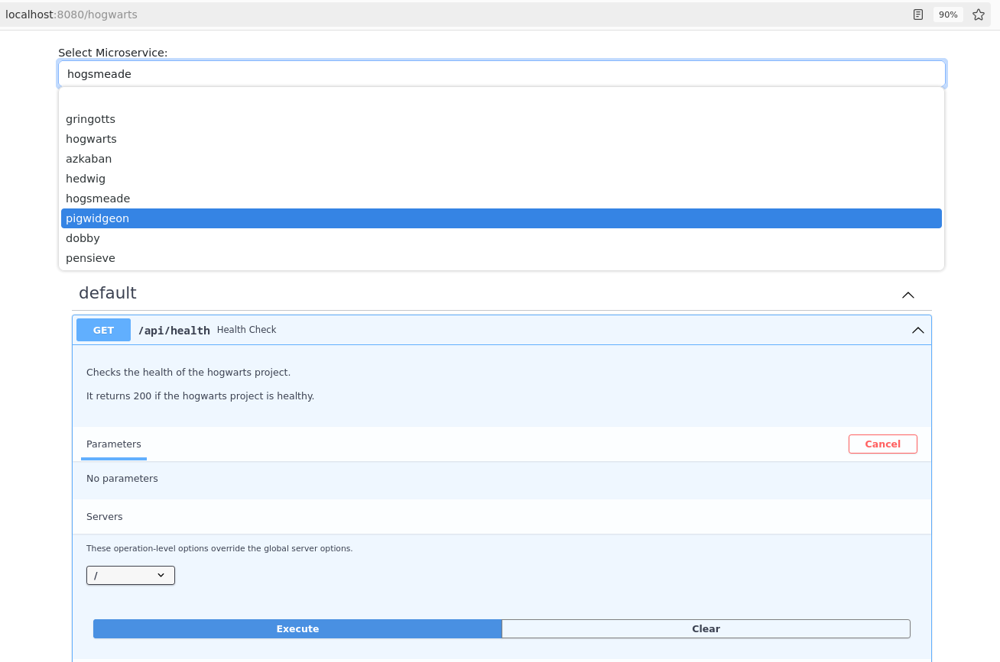

# oasbinder

[](https://github.com/insightsengineering/oasbinder/actions/workflows/test.yml)

`oasbinder` is a utility which allows you to interact with multiple Swagger (OAS) docs for multiple microservices which can be defined in the [configuration file](#configuration-file).

Let's assume we have the following service in the configuration file and the user accesses `oasbinder` at https://oasbinder.example.com.
```yaml
services:
  - name: hogwarts
    endpoint: /hogwarts
    url: http://localhost:8000/hogwarts/
```

User can request the OAS docs for the `hogwarts` microservice by going to https://oasbinder.example.com/hogwarts in the browser.

`oasbinder` will request the OAS specification from the service at http://localhost:8000/hogwarts/openapi.json and return it to the user for viewing and interacting in the browser.
The location of the OAS specs is configurable.
Multiple services can be configured and user can then select them from a drop-down list.



## Installing

Simply download the project for your distribution from the [releases](https://github.com/insightsengineering/oasbinder/releases) page.
`oasbinder` is distributed as a single binary file and does not require any additional system requirements.

Alternatively, if you have a Go environment, you can simply install `oasbinder` by running:

```shell
go install github.com/insightsengineering/oasbinder@latest
```

## Usage

`oasbinder` is a command line utility, so after installing the binary in your `PATH`, simply run the following command to view its capabilities:

```bash
oasbinder --help
```

## Configuration file

By default `oasbinder` attempts to read `~/.oasbinder`, `~/.oasbinder.yaml` and `~/.oasbinder.yml` configuration files.
If any of these files exist, `oasbinder` uses options defined there, unless they are overridden by command line flags.

You can also specify custom path to configuration file with `--config <your-configuration-file>.yml` command line flag.

Example contents of configuration file:

```yaml
# The address at which the user will access `oasbinder`.
address: http://localhost:8080
# The port on which `oasbinder` will listen. This can be used in case `oasbinder` is run in e.g. in a k8s cluster
# and the user is accessing it from the outside of the cluster.
port: 8080

services:
  - name: gringotts
    endpoint: /gringotts
    url: http://localhost:8000/gringotts/
  - name: hogwarts
    endpoint: /hogwarts
    url: http://localhost:8000/hogwarts/

# Additional headers to pass to microservices, e.g. for authentication.
headers:
  api-key: qwerty
```

## Environment variables

`oasbinder` reads environment variables with `OASBINDER_` prefix and tries to match them with CLI flags.
For example, setting the following variables will override the respective value from the configuration file: `OASBINDER_LOGLEVEL` etc.

The order of precedence is:

CLI flag → environment variable → configuration file → default value.

To check the available names of environment variables, please run `oasbinder --help`.

## Development

This project is built with the [Go programming language](https://go.dev/).

### Development Environment

It is recommended to use Go 1.23+ for developing this project.
This project uses a pre-commit configuration and it is recommended to [install and use pre-commit](https://pre-commit.com/#install) when you are developing this project.

### Common Commands

Run `make help` to list all related targets that will aid local development.

## License

`oasbinder` is licensed under the Apache 2.0 license. See [LICENSE](LICENSE) for details.
